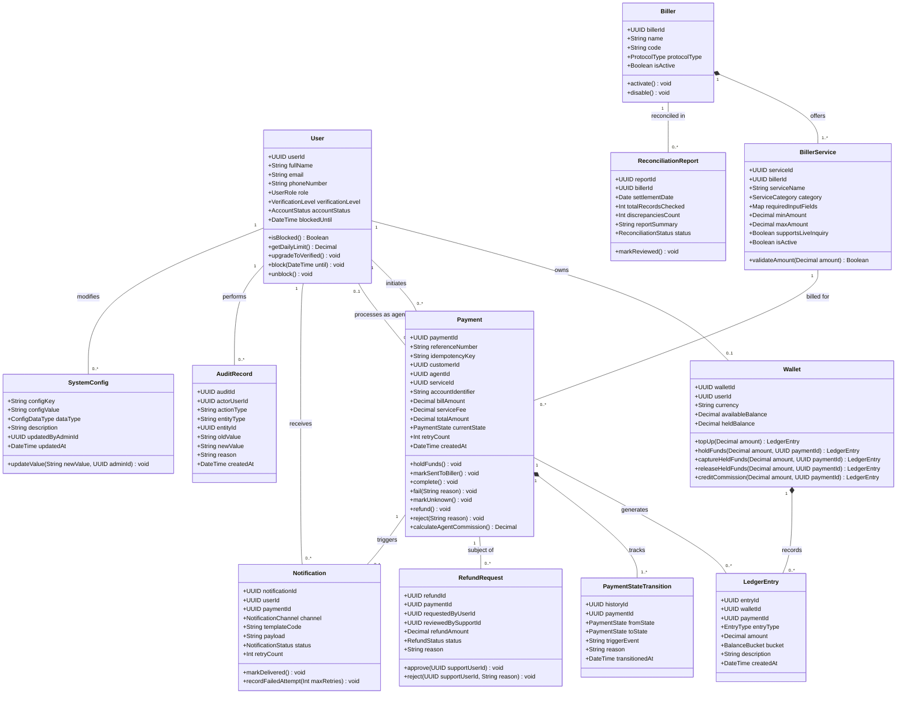

```mermaid
classDiagram
    class User {
        +UUID userId
        +String fullName
        +String email
        +String phoneNumber
        +UserRole role
        +VerificationLevel verificationLevel
        +AccountStatus accountStatus
        +DateTime blockedUntil
        +isBlocked() Boolean
        +getDailyLimit() Decimal
        +upgradeToVerified() void
        +block(DateTime until) void
        +unblock() void
    }

    class Wallet {
        +UUID walletId
        +UUID userId
        +String currency
        +Decimal availableBalance
        +Decimal heldBalance
        +topUp(Decimal amount) LedgerEntry
        +holdFunds(Decimal amount, UUID paymentId) LedgerEntry
        +captureHeldFunds(Decimal amount, UUID paymentId) LedgerEntry
        +releaseHeldFunds(Decimal amount, UUID paymentId) LedgerEntry
        +creditCommission(Decimal amount, UUID paymentId) LedgerEntry
    }

    class LedgerEntry {
        +UUID entryId
        +UUID walletId
        +UUID paymentId
        +EntryType entryType
        +Decimal amount
        +BalanceBucket bucket
        +String description
        +DateTime createdAt
    }

    class Biller {
        +UUID billerId
        +String name
        +String code
        +ProtocolType protocolType
        +Boolean isActive
        +activate() void
        +disable() void
    }

    class BillerService {
        +UUID serviceId
        +UUID billerId
        +String serviceName
        +ServiceCategory category
        +Map requiredInputFields
        +Decimal minAmount
        +Decimal maxAmount
        +Boolean supportsLiveInquiry
        +Boolean isActive
        +validateAmount(Decimal amount) Boolean
    }

    class Payment {
        +UUID paymentId
        +String referenceNumber
        +String idempotencyKey
        +UUID customerId
        +UUID agentId
        +UUID serviceId
        +String accountIdentifier
        +Decimal billAmount
        +Decimal serviceFee
        +Decimal totalAmount
        +PaymentState currentState
        +Int retryCount
        +DateTime createdAt
        +holdFunds() void
        +markSentToBiller() void
        +complete() void
        +fail(String reason) void
        +markUnknown() void
        +refund() void
        +reject(String reason) void
        +calculateAgentCommission() Decimal
    }

    class PaymentStateTransition {
        +UUID historyId
        +UUID paymentId
        +PaymentState fromState
        +PaymentState toState
        +String triggerEvent
        +String reason
        +DateTime transitionedAt
    }

    class RefundRequest {
        +UUID refundId
        +UUID paymentId
        +UUID requestedByUserId
        +UUID reviewedBySupportId
        +Decimal refundAmount
        +RefundStatus status
        +String reason
        +approve(UUID supportUserId) void
        +reject(UUID supportUserId, String reason) void
    }

    class Notification {
        +UUID notificationId
        +UUID userId
        +UUID paymentId
        +NotificationChannel channel
        +String templateCode
        +String payload
        +NotificationStatus status
        +Int retryCount
        +markDelivered() void
        +recordFailedAttempt(Int maxRetries) void
    }

    class AuditRecord {
        +UUID auditId
        +UUID actorUserId
        +String actionType
        +String entityType
        +UUID entityId
        +String oldValue
        +String newValue
        +String reason
        +DateTime createdAt
    }

    class SystemConfig {
        +String configKey
        +String configValue
        +ConfigDataType dataType
        +String description
        +UUID updatedByAdminId
        +DateTime updatedAt
        +updateValue(String newValue, UUID adminId) void
    }

    class ReconciliationReport {
        +UUID reportId
        +UUID billerId
        +Date settlementDate
        +Int totalRecordsChecked
        +Int discrepanciesCount
        +String reportSummary
        +ReconciliationStatus status
        +markReviewed() void
    }

    User "1" -- "0..1" Wallet : owns
    Wallet "1" *-- "0..*" LedgerEntry : records
    Payment "1" -- "0..*" LedgerEntry : generates
    User "1" -- "0..*" Payment : initiates
    User "0..1" -- "0..*" Payment : processes as agent
    Biller "1" *-- "1..*" BillerService : offers
    Biller "1" -- "0..*" ReconciliationReport : reconciled in
    BillerService "1" -- "0..*" Payment : billed for
    Payment "1" *-- "1..*" PaymentStateTransition : tracks
    Payment "1" -- "0..*" RefundRequest : subject of
    User "1" -- "0..*" Notification : receives
    Payment "1" -- "0..*" Notification : triggers
    User "1" -- "0..*" AuditRecord : performs
    User "1" -- "0..*" SystemConfig : modifies
```