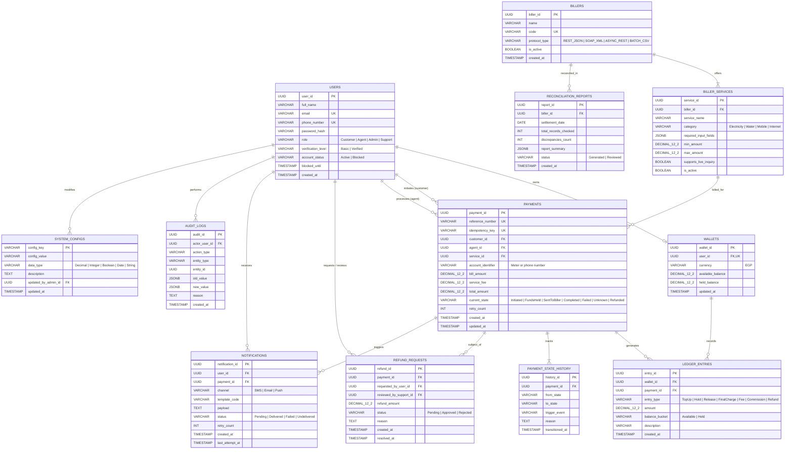

```mermaid
erDiagram
    USERS {
        UUID user_id PK
        VARCHAR full_name
        VARCHAR email UK
        VARCHAR phone_number UK
        VARCHAR password_hash
        VARCHAR role "Customer | Agent | Admin | Support"
        VARCHAR verification_level "Basic | Verified"
        VARCHAR account_status "Active | Blocked"
        TIMESTAMP blocked_until
        TIMESTAMP created_at
    }

    WALLETS {
        UUID wallet_id PK
        UUID user_id FK, UK
        VARCHAR currency "EGP"
        DECIMAL_12_2 available_balance
        DECIMAL_12_2 held_balance
        TIMESTAMP updated_at
    }

    LEDGER_ENTRIES {
        UUID entry_id PK
        UUID wallet_id FK
        UUID payment_id FK
        VARCHAR entry_type "TopUp | Hold | Release | FinalCharge | Fee | Commission | Refund"
        DECIMAL_12_2 amount
        VARCHAR balance_bucket "Available | Held"
        VARCHAR description
        TIMESTAMP created_at
    }

    BILLERS {
        UUID biller_id PK
        VARCHAR name
        VARCHAR code UK
        VARCHAR protocol_type "REST_JSON | SOAP_XML | ASYNC_REST | BATCH_CSV"
        BOOLEAN is_active
        TIMESTAMP created_at
    }

    BILLER_SERVICES {
        UUID service_id PK
        UUID biller_id FK
        VARCHAR service_name
        VARCHAR category "Electricity | Water | Mobile | Internet"
        JSONB required_input_fields
        DECIMAL_12_2 min_amount
        DECIMAL_12_2 max_amount
        BOOLEAN supports_live_inquiry
        BOOLEAN is_active
    }

    PAYMENTS {
        UUID payment_id PK
        VARCHAR reference_number UK
        VARCHAR idempotency_key UK
        UUID customer_id FK
        UUID agent_id FK
        UUID service_id FK
        VARCHAR account_identifier "Meter or phone number"
        DECIMAL_12_2 bill_amount
        DECIMAL_12_2 service_fee
        DECIMAL_12_2 total_amount
        VARCHAR current_state "Initiated | FundsHeld | SentToBiller | Completed | Failed | Unknown | Refunded"
        INT retry_count
        TIMESTAMP created_at
        TIMESTAMP updated_at
    }

    PAYMENT_STATE_HISTORY {
        UUID history_id PK
        UUID payment_id FK
        VARCHAR from_state
        VARCHAR to_state
        VARCHAR trigger_event
        TEXT reason
        TIMESTAMP transitioned_at
    }

    REFUND_REQUESTS {
        UUID refund_id PK
        UUID payment_id FK
        UUID requested_by_user_id FK
        UUID reviewed_by_support_id FK
        DECIMAL_12_2 refund_amount
        VARCHAR status "Pending | Approved | Rejected"
        TEXT reason
        TIMESTAMP created_at
        TIMESTAMP resolved_at
    }

    NOTIFICATIONS {
        UUID notification_id PK
        UUID user_id FK
        UUID payment_id FK
        VARCHAR channel "SMS | Email | Push"
        VARCHAR template_code
        TEXT payload
        VARCHAR status "Pending | Delivered | Failed | Undelivered"
        INT retry_count
        TIMESTAMP created_at
        TIMESTAMP last_attempt_at
    }

    AUDIT_LOGS {
        UUID audit_id PK
        UUID actor_user_id FK
        VARCHAR action_type
        VARCHAR entity_type
        UUID entity_id
        JSONB old_value
        JSONB new_value
        TEXT reason
        TIMESTAMP created_at
    }

    SYSTEM_CONFIGS {
        VARCHAR config_key PK
        VARCHAR config_value
        VARCHAR data_type "Decimal | Integer | Boolean | Date | String"
        TEXT description
        UUID updated_by_admin_id FK
        TIMESTAMP updated_at
    }

    RECONCILIATION_REPORTS {
        UUID report_id PK
        UUID biller_id FK
        DATE settlement_date
        INT total_records_checked
        INT discrepancies_count
        JSONB report_summary
        VARCHAR status "Generated | Reviewed"
        TIMESTAMP created_at
    }

    USERS ||--o| WALLETS : "owns"
    WALLETS ||--o{ LEDGER_ENTRIES : "records"
    PAYMENTS ||--o{ LEDGER_ENTRIES : "generates"
    USERS ||--o{ PAYMENTS : "initiates (customer)"
    USERS ||--o{ PAYMENTS : "processes (agent)"
    BILLERS ||--|{ BILLER_SERVICES : "offers"
    BILLERS ||--o{ RECONCILIATION_REPORTS : "reconciled_in"
    BILLER_SERVICES ||--o{ PAYMENTS : "billed_for"
    PAYMENTS ||--|{ PAYMENT_STATE_HISTORY : "tracks"
    PAYMENTS ||--o{ REFUND_REQUESTS : "subject_of"
    USERS ||--o{ REFUND_REQUESTS : "requests / reviews"
    USERS ||--o{ NOTIFICATIONS : "receives"
    PAYMENTS ||--o{ NOTIFICATIONS : "triggers"
    USERS ||--o{ AUDIT_LOGS : "performs"
    USERS ||--o{ SYSTEM_CONFIGS : "modifies"
```